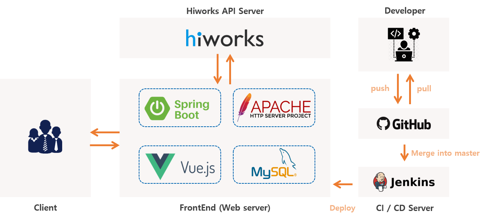

# 계발자 프로젝트

## 개요
1. 온라인/오프라인 교육 수강 내역을 등록하여, 관리할 수 있는 웹서비스입니다.
2. 등록한 교육 내역에 대해서 통계 데이터를 제공합니다.
 - TOP3 카테고리
 - TOP3 태그
 - 월별 교육 시간, 연간 교육 시간
3. 등록한 교육 내역을 공유 / 추천할 수 있는 게시판 기능을 제공합니다.
4. 등록한 교육 내역에 대해 사용자의 월별 랭킹 기능을 제공합니다.

 
 

## 환경

|API Server|Front Server|Database|CI/CD|
|:--------:|:----------:|:------:|:---:|
|Spring Boot 2.2.4   Gradle 6   Java 8|Vue.js   Vuetify 1.4.3|Mysql 5.7 (InnoDB)|Jenkins 2.204|

  

## Architecture

 

  

## ERD

 

https://www.erdcloud.com/d/tFRNX4nap2Wv5kQFy

  

## Entity-Diagram

 

  

## Code review

 
  
 

  

## Examples

 
  
 

 

  

**Date**

- 2020.01.06 ~ 2020.03.20 (12 weeks)

 
