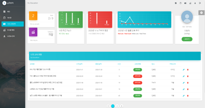

# 계발자 프로젝트

### 개요
1. 교육 내역을 등록하고, 관리할 수 있는 웹 서비스
2. 교육 내역에 대한 통계 데이터 제공
 - TOP3 카테고리 (어떤 카테고리가 많이 사용되었는지)
 - TOP3 태그 (어떤 태그가 많이 사용되었는지)
 - 월별 교육 시간, 연간 교육 시간
 
 

### Environment

- **SpringBoot 2.2.4**
  - Gradle 6
  - JAVA 8
- **Vue.js**
  - Vuetify 1.4.3
  - Node 6.13.4
- **Mysql 5.7.29**
  - InnoDB
- **Jenkins 2.204.5**

 

### ERD

https://www.erdcloud.com/d/tFRNX4nap2Wv5kQFy

### Entity diagram

 

### Code review

 

### Examples

 

**Date**

- 2020.01.06 ~ 2020.03.20 (12 weeks)
